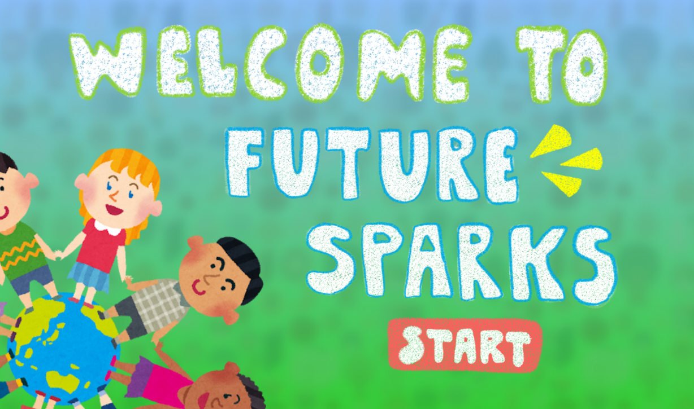
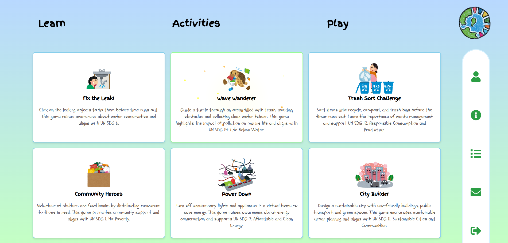
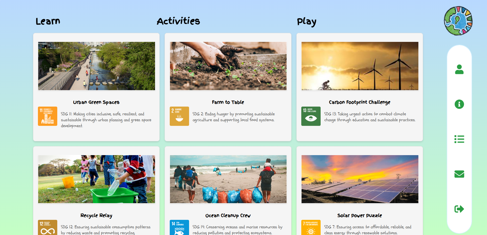
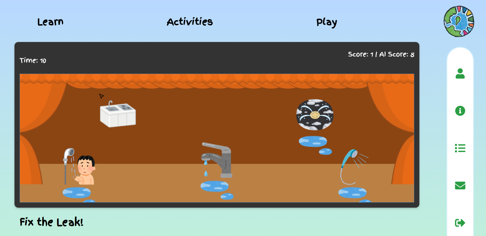

# FutureSparks
This project was conceived at the Hackathon hosted at Sacramento State.

Its an interactive, kid friendly web app that teaches the **United Nations Sustainable Development Goals (SDGs)** through short descriptions and AI augmented mini-games.


<p align="center">
  
</p>

> ⚠️ **Safety & Educational Use Only**  
> The chatbot and games are for learning. Content may not always be perfectly accurate or up-to-date. 

<br>

</br>

## Features
- **Play Dashboard** with mini-games descriptions mapped to SDGs.

<p align="center">
  
</p>

- **Learn/Activity Dashboard** with bite-size, image rich articles and descriptions.

<p align="center">
  
</p>

- **Leaderboard** per mode (Easy/Hard/AI) backed by the Django API.
- **Global Header** with quick navigation (Learn ▸ Activities ▸ Play).
- **Sound & Animation Effects** for engagement.

### SDG Alignment (examples)
- **Fix the Leak!** → **SDG 6** (Clean Water & Sanitation)  
Future implementations: 
- **Wave Wanderer** (Turtle & trash) → **SDG 14** (Life Below Water)  
- **Trash Sort Challenge** → **SDG 12** (Responsible Consumption & Production)  
- **Community Heroes** → **SDG 1** (No Poverty)  
- **Power Down** → **SDG 7** (Affordable & Clean Energy)  
- **City Builder** → **SDG 11** (Sustainable Cities & Communities)  


<br>


</br>

## Tech Stack
<!-- Frontend -->
Frontend: 


<!-- Backend -->
Backend: 


<!-- Media -->
Media: 


<br>

</br>

## Local Development
-  Node.js ≥ 18 and npm  
-  Python ≥ 3.10  

<br>


</br>

1.) Backend
```
cd backend
py -m venv .venv
.\.venv\Scripts\activate
python -m pip install --upgrade pip
python -m pip install Django djangorestframework django-cors-headers python-dotenv
python manage.py migrate
python manage.py runserver   :: http://localhost:8000
```


2.) Frontend
```
cd frontend
npm install
npm start     # http://localhost:3000
```

<br>

</br>

## Game Description 
### Quick Test of Game 1
- Fix the Leak! (Functional): Click leaking fixtures to stop water loss before time runs out. Modes: *Easy*, *Hard*, *Vs AI*.


<p align="center">
  
</p>

1. Start backend & frontend.
2. Visit /gameDashboard and open Fix the Leak!.
3. Pick Easy, Hard, or Vs AI.
4. Click only flickering/leaking fixtures to gain points; wrong clicks deduct points.
5. When time hits 0, the score auto-submits to the leaderboard.


<br>

</br>

## Acknowledgements

- United Nations Sustainable Development Goals framework.
- Open-source libraries and icon sets used in the app.